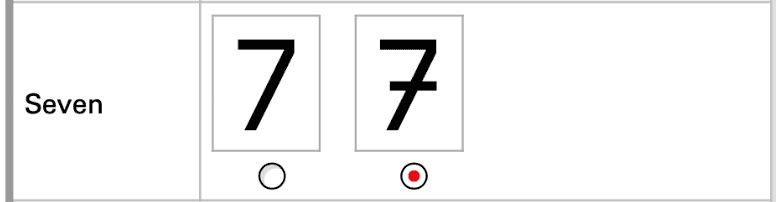

Ever since [Jetbrains Mono](https://www.jetbrains.com/lp/mono/) released back in 2020, I've been rolling with that for almost all my monospace font needs. The only exception to that is when I've been after a more typewriter-esque feel, for which I reach for [Drafting](https://indestructibletype.com/Drafting/).

As an editor/terminal font, Jetbrains Mono is *very* good, but I've finally found a new favorite after five years — [Berkeley Mono](https://usgraphics.com/products/berkeley-mono). It's well crafted and has an obvious personality. Just look at the optional 7 style, it has a strike or crossguard or whatever you want to call it, just like how I write 7 by hand.

I highly recommend it and have switched over to it in my editor (currently [Zed](https://zed.dev/)) and terminal ([Ghostty](https://ghostty.org/)).
